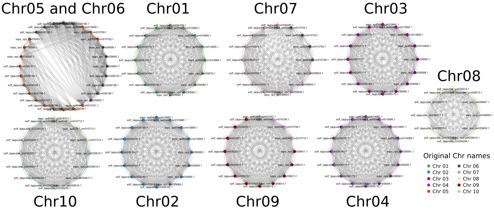

# Sugarcane SP80-3280 Genome Assembly

## Sequencing data

### PacBio HiFi

Young plants of the sugarcane cultivar SP80-3280 were grown in a greenhouse at CENA/USP for approximately four weeks. Before leaf collection, the plants were subjected to a 36-hour dark treatment. Following this, all leaves were harvested, cut into small fragments, stored in aluminum pouches, flash-frozen in liquid nitrogen, and subsequently stored at -80 °C. Approximately 9 grams of leaf fragments were sent to the Arizona Genomics Institute for sequencing on October 2022, utilizing PacBio HiFi chemistry on a Sequel II instrument.

#### DNA extraction protocol

CTAB HMW DNA extraction

High molecular weight DNA was extracted from young leaves using the protocol of Doyle and Doyle (1987) with minor modifications. Flash-frozen young leaves were ground to a fine powder in a frozen mortar with liquid nitrogen followed by very gentle extraction in 2% CTAB buffer (that included proteinase K, PVP-40 and beta-mercaptoethanol) for 1 h at 50 °C. After centrifugation, the supernatant was gently extracted twice with 24:1 chloroform:isoamyl alcohol. The upper phase was adjusted to 1/10th volume with 3 M NaAc, gently mixed, and DNA precipitated with iso-propanol. DNA was collected by centrifugation, washed with 70% ethanol, air dried for 20 minutes and dissolved thoroughly in 1x TE at room temperature. DNA purity was measured with Nanodrop, DNA concentration measured with Qubit HS kit (Invitrogen) and DNA size was validated by Femto Pulse System (Agilent).

Doyle, J.J. and J.L. Doyle. 1987. A rapid DNA isolation procedure from small quantities of fresh leaf tissues. Phytochem Bull. 19:11–15.

#### Library preparation

| **Library A** | |
| ---- | ---- |
| DNA Shearing	| Megaruptor 3  with Speed Code 29 & 30 - combined |
| AMPure Beads Selection | > 5Kb |
| DNA Input |10 ug; library prep : 2 rxns |
| Library Prep Kit |SMRTbell Prep Kit 3.0 |
| Protocol |https://acrobat.adobe.com/link/review?uri=urn:aaid:scds:US:20db5dcd-096c-3c92-827d-9d88b1db4326 or [here](Procedure-checklist-Preparing-whole-genome-and-metagenome-libraries-using-SMRTbell-prep-kit-3.0.pdf) |
| Size Selection |Sage Sciences; Pippin HT; Definition: 9-30kb, R+T, 75E (15kb cut off, 30min elution) | 
| | Error on the selection procedure;  Just 718 ng of final library recovered |
| Library QC |DNA quantification: Qubit (Qubit fluorometer & Qubit 1X dsDNA HS assay kit - 718 ng recovered);  DNA sizing: Femto Pulse system (Femto Pulse gDNA 165kb analysis kit - 19.9kb Ave size ) | 

	
| **Library B** | | 
| ---- | ---- |
| DNA Shearing | Megarupter  with Speed Code 29 & 30 - combined |
| DNA Input | 13.5 ug; library prep : 3 rxns |
| Library Prep Kit | SMRTbell Prep Kit 3.0 |
| Protocol | https://acrobat.adobe.com/link/review?uri=urn:aaid:scds:US:20db5dcd-096c-3c92-827d-9d88b1db4326 or [here](Procedure-checklist-Preparing-whole-genome-and-metagenome-libraries-using-SMRTbell-prep-kit-3.0.pdf) |
| Size Selection | Sage Sciences; Pippin HT; Definition: 9-30kb, R+T, 75E (13kb cut off, 30min elution) |
| Library QC | DNA quantification: Qubit (Qubit fluorometer & Qubit 1X dsDNA HS assay kit - 1.858 ug recovered);  DNA sizing: Femto Pulse system (Femto Pulse gDNA 165kb analysis kit - 21.6kb Ave size) |

| Sample Name | CCS Reads |  CCS Yield (Gb) | Mean Length | N50 | Mean QV | Date delivered | Sequencing instrument |
| --- | --- | --- | --- | --- | --- | --- | --- |
| Saccharum hybrid-SP80-3280_80pM_01 | 1581718 | 30.3 | 19156 | 19043 | Q32 | 27/10/2022 | Sequel IIe |
| Saccharum hybrid-SP80-3280_80pM_03 | 1699007 | 32.6 |  | 19052 | | 31/10/2022 | Sequel IIe |
| Saccharum hybrid-SP80-3280_70pM_04 | 1638846 | 31.3 |  | 19009 | | 31/10/2022 | Sequel IIe |
| Saccharum hybrid-SP80-3280_80pM_04 | 1469380 | 26.6 | 18095 | 18278 | Q33 | 10/01/2023 | Sequel II |
| Saccharum hybrid-SP80-3280_80pM_05 | 1566401 | 28.4 | 18126 | 18299 | Q32 | 10/01/2023 | Sequel II |
| Saccharum hybrid-SP80-3280_80pM_06 | 1573798 | 28.5 | 18097 | 18286 | Q32 | 10/01/2023 | Sequel II |
| Saccharum hybrid-SP80-3280_80pM_07 | 1521580 | 27.6 | 18150 | 18341 | Q32 | 10/01/2023 | Sequel II |
| Saccharum hybrid-SP80-3280_80pM_08 | 1565600 | 28.3 | 18100 | 18301 | Q32 | 10/01/2023 | Sequel II |
| Saccharum hybrid-SP80-3280_80pM_09 | 1419570 | 25.7 | 18116 | 18318 | Q32 | 10/01/2023 | Sequel II |
| Saccharum hybrid-SP80-3280_80pM_10 | 1458313 | 26.4 | 18105 | 18323 | Q32 | 10/01/2023 | Sequel II |
| Saccharum hybrid-SP80-3280_80pM_11 | 1469516 | 26.6 | 18131 | 18354 | Q30 | 10/01/2023 | Sequel II |

### HiC

Restriction enzymes used

| Enzyme | Web page | Cleavage site |
| --- | --- | --- |
| DPNII | https://international.neb.com/products/r0543-dpnii | |
| DDEI  | https://international.neb.com/products/r0175-ddel  |  |
| HINFI | https://international.neb.com/products/r0155-hinfi |  |
| MSEI  | https://international.neb.com/products/r0525-msei  |  |

### Nanopore data

In collaboration with the group of [Dr. Maria Imaculada Zucchi](https://www.genomicadaconservacao.com.br/equipe) (Dr. Caroline B. Garcia and Dr. Matheus Scaketti) we generated some Nanopore reads, with the main aim to get ultralong reads. This was for the same cultivar SP80-3280 that we maintain at CENA/USP.

Three datasets were generated and delivered in October 2025.

| Sample Name | Number Reads |  Yield (bp) | N50 | N25 | Date delivered | Sequencing instrument | Figure |
| --- | --- | --- | --- | --- | --- | --- | -- | 
| cana_ont1 | 147842 | 697428086 | 15628 | 36215 | 28/10/2025 | P2 Solo | [SeqStats](Figs/cana_ont1.seqStats_seqStats.png) |
| cana_ont2 | 4682701 | 27670943957 | 18646 | 38326 | 28/10/2025 | P2 Solo | [SeqStats](Figs/cana_ont2.seqStats_seqStats.png) |
| cana_ont3 |  |  |  |  | 28/10/2025 | P2 Solo | [SeqStats](Figs/cana_ont2.seqStats_seqStats.png) |

## Chromosome comparisons of parental species

We are comparing _S. officinarum_ LA-Purple with a basic number of chromosomes of 10,  each with 8 copies, so x=10, 2n=80, _S. spontaneum_ AP85-441 x=8, 2n=32, and _S. spontaneum_ NpX with x=10, 2n=40.

### kmer comparison with sourmash

We did a fast comparison of similarity among pairs of chromosomes of thes varieties, using [sourmarch](https://sourmash.readthedocs.io/en/latest/) with this [script](sourmash_comps/sourmash.sh). Results of the comparisons are in the [sourmarch_comps folder](sourmash_comps/). The sourmash results were processed with this [script](sourmash_comps/createChromosomeSimilarityGraph.py), and can be visualized in the following figure ([SVG](chrgraphs/chromosomesGraphSaccharum.svg), [Cytoscape](chrgraphs/chromosomesGraphSaccharum.sys)):

### Chr alignments with minimap2
